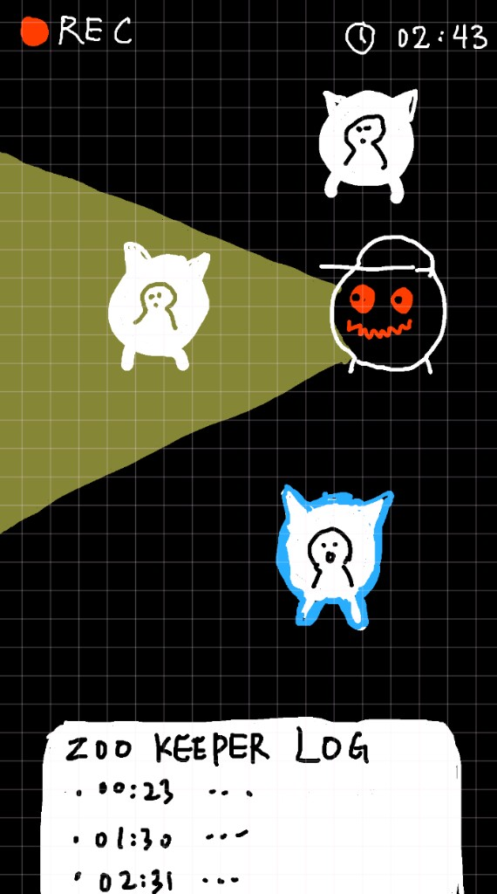

# Nocturne Zoo · 美术方向（Graphic Noir）

> 与 GDD 并行：定义**视觉语言**，便于前端与后续素材统一。参考方向为「极简色块 + 高对比黑白 + 少量锈红」，接近德国表现主义 / Risograph 图形小说气质；节奏与压迫感可对照《邪恶冥刻》的**桌面仪式与模拟介质**，而非写实或霓虹赛博。

## 概念美术（本仓库）

监视向主界面草图（网格、REC、计时、日志区）：

源文件路径：`docs/concept-art/ui-surveillance-zookeeper-log.png`（索引见 `docs/concept-art/README.md`）。

## 0. 气质参照：《邪恶冥刻 / Inscryption》（只借氛围，不抄资产）

本作与 Inscryption **类型不同**（我们是实时社交 + 身体守则），但可以借其**观感与仪式感**：

- **桌面 / 档案仪式**：UI 像「被摊在桌上的规则」——硬边卡框、压印感、少动画炫技；重要信息像卡牌翻面或档案盖章一样出现（动效以后可做，先保持静态层级清晰）。
- **模拟介质的压迫感**：极轻的扫描线、暗角、颗粒，暗示「老设备 / 被监视的记录」，而不是干净 SaaS 面板。
- **卡牌式外框**：主面板用**双线轮廓**（外框 + 内细线），选项行像「待抽的牌」或表格行，而不是气泡对话。
- **叙事留白**：大量黑底负空间 + 少量锈红，对应 Inscryption 里「未知比血腥更吓人」的节奏；**禁止**在通用 UI 上堆血渍、断指等具象素材（留给叙事文本与结算演出）。

**刻意不做**：复刻 Inscryption 的 wood cabin 主色、具体角色剪影、牌背纹样等受版权保护或强识别的资产。我们只吸收**结构语言**与**情绪曲线**。

## 1. 核心关键词

- **平面色块**：大面积纯黑或近黑底，结构用米白线框与几何分割，少用渐变。
- **高对比**：阅读优先，避免灰阶糊成一团。
- **锈红作强调**：仅用于主按钮、危险、录制、强调边线；禁止把红色铺满背景。
- **颗粒 / 印刷感**：整体可加轻噪点或细点阵，模拟纸本 / 丝网印（实现上见 `server/app/src/styles/globals.css` 中 `body::before` 等）。
- **轮廓**：主站为 React SPA，全局使用 **中圆角**（约 `16px`–`20px`）与较柔和阴影，与入场圆镜头等保持统一。

## 2. 色板（Token）

| Token | 色值 | 用途 |
| --- | --- | --- |
| `nz-black` | `#0A0A0A` | 主背景、负空间 |
| `nz-ink` | `#121212` | 卡片 / 浮层 |
| `nz-cream` | `#F2EFE9` | 主文字、线框、图标描边 |
| `nz-cream-dim` | `rgba(242,239,233,0.55)` | 次要说明 |
| `nz-red` | `#D6402E` | 主 CTA、危险态、强调描边 |
| `nz-red-glow` | `rgba(214,64,46,0.22)` | 顶部微弱氛围光（非渐变炫光） |

**禁止**：高饱和青 / 紫 / 黄的大面积渐变底（旧 Demo 的「街机蓝」已弃用）。

## 3. UI 规则

- **卡片**：深灰 `#121212` + 1px 米白半透明边 + **内缘再压一条更淡的线**（卡牌衬边）+ 硬投影（offset shadow）表达层级，不用强玻璃拟态。
- **主按钮（primary）**：锈红底 + 米白字；悬停时提高**描边对比**而非整体变亮。
- **次要按钮**：黑底或 ink 底 + 米白细边；悬停可加锈红描边。
- **问卷选项**：与次要按钮一致；避免每选项不同彩虹色。
- **链接**：默认米白underline；悬停锈红。
- **状态点**：连接成功可用米白圆点；错误 / 录制用锈红。

## 4. 构图与图形（角色 / 插画若后续补充）

- **角色**：可简化为**剪影 + 少量几何附加形**（翼、星、框），内部少细节；阴影用点阵 / 噪点而非光滑渐变。
- **符号**：竖线、星形、尖拱等可抽象化，保持细线版本与色块版本两套规范。
- **镜头区域**：矩形线框包住实时画面，避免圆角过大削弱「监视 / 档案」气质。
- **字体层级（主客户端）**：标题可用偏「目录 / 扉页」的衬线；日志与状态保持等宽或中性无衬线，像终端记录（字体与颜色 token 在 `server/app/src/styles/*.css`）。

## 5. 技术落地（当前仓库）

- **主题与布局**：Vite + React 入口 `server/app/src/main.tsx`；全局 token 与基样式在 `server/app/src/styles/globals.css`，各屏布局在 `server/app/src/styles/screens.css`。生产构建输出到 `server/public/`（由 `npm run build` 在 `server/app` 生成）。
- **修改主题时**：改上述两个 CSS 中的 `:root` 变量与组件类名，避免在多处硬编码色值。
- **Inscryption 向的滤镜**：轻扫描线、暗角、颗粒叠在 `body` 伪元素层（`globals.css`），强度以「长时间游玩不疲劳」为上限。

## 6. 与策划文档的关系

- GDD 中的机制、流程不变；本文件只约束**观感**，使「深夜动物园」更像**纸质规则怪谈档案**而非休闲手游 UI。
